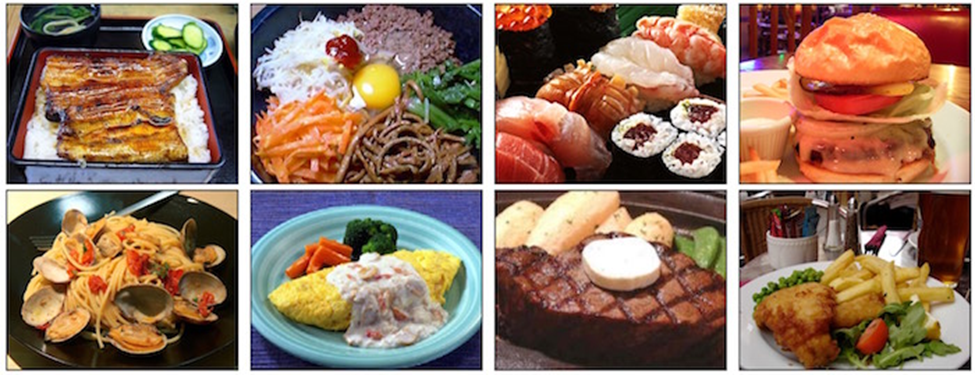
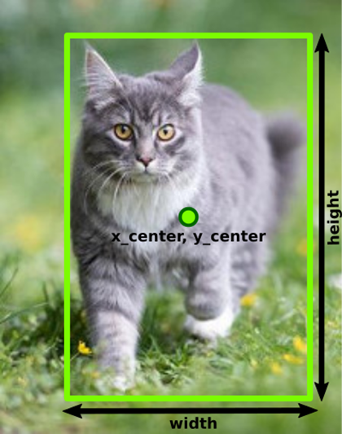
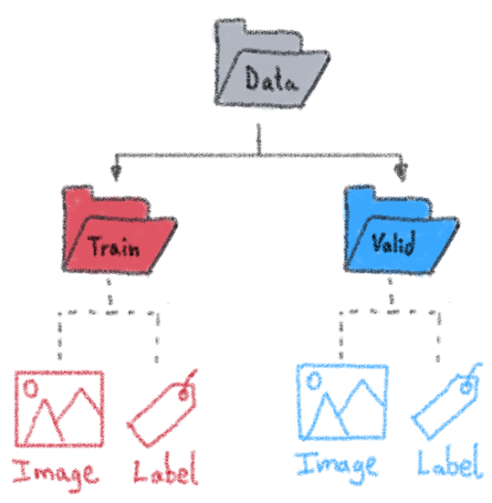
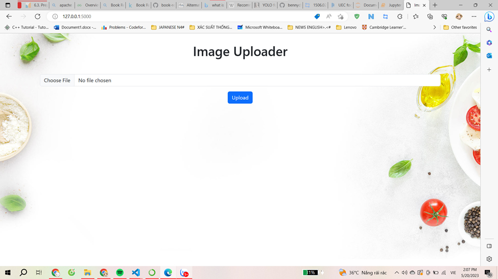
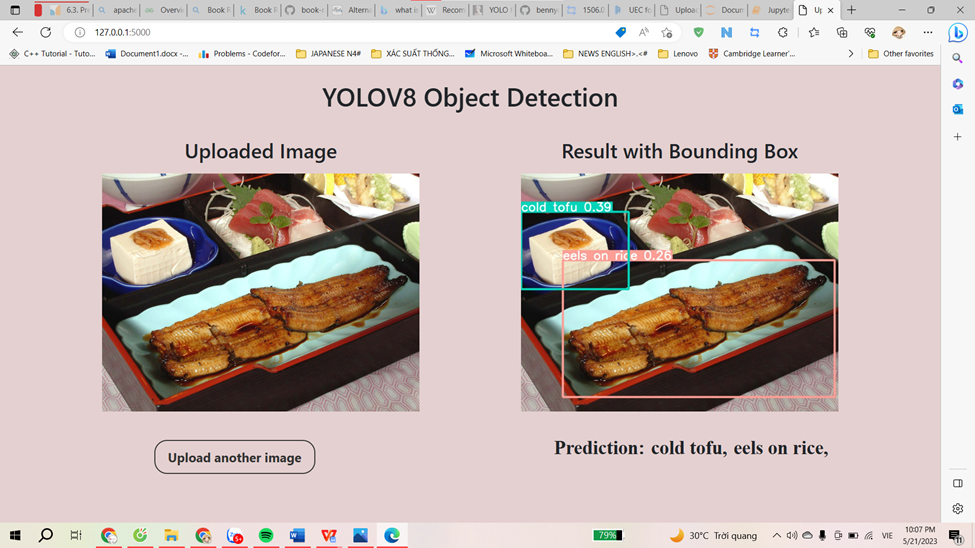

# Food_Recognition_YoloV8
###Ứng dụng AI nhận diện đồ ăn 

**##MỤC TIÊU ĐỀ TÀI**

- Mục tiêu của việc sử dụng yolov8 trong ứng dụng AI nhận diện đồ ăn là để xây dựng một hệ thống nhận diện đồ ăn tự động, cho phép phát hiện và xác định các món ăn trong hình ảnh hoặc video qua thời gian thực (real-time). 

##TÍNH MỚI VÀ SÁNG TẠO

- Giới thiệu mô hình yolov8 để nhận diện đồ ăn trong hình ảnh hoặc video qua thời gian thực. Bằng việc nhận diện đồ ăn trong hình ảnh và video mà người dùng đăng tải lên, hệ thống có thể cung cấp cho người dùng thông tin chi tiết về các món ăn có trong hình ảnh hoặc video.

- Dựa trên kết quả nhận diện món ăn, hệ thống có thể đưa ra gợi ý và khuyến nghị về các món ăn tương tự hoặc các món ăn phù hợp với khẩu vị và nhu cầu dinh dưỡng của người dùng. Điều này có thể giúp người dùng tìm kiếm những món ăn mới, tăng sự đa dạng trong chế độ ăn uống và chăm sóc sức khỏe.

##Data
Thực hiện huấn luyện mô hình YOLOv8 dựa trên bộ dữ liệu UCEFOOD100 (nguồn: **http://foodcam.mobi/dataset100.html**) từ Nhóm nghiên cứu nhận dạng thực phẩm tại Đại học Electro-Communications, Nhật Bản để giải quyết bài toán nhận diện đồ ăn.

**Thông tin chi tiết về bộ dữ liệu UECFOOD100:**
1.	Số lượng mẫu: Bộ dữ liệu UECFOOD100 bao gồm tổng cộng 14,361 Files ảnh, 100 Folders chứa hình ảnh của 100 loại món ăn khác nhau. Mỗi loại món ăn có khoảng 100-200 mẫu.
2.	Các loại món ăn: Bộ dữ liệu bao gồm các món ăn đa dạng, bao gồm sushi, sashimi, mì ramen, gà chiên, tempura, bánh mỳ, trái cây, kem, nước ngọt, và nhiều món ăn khác. Các loại món ăn này đại diện cho sự đa dạng và phong phú của ẩm thực Nhật Bản.

3.	Đa dạng góc chụp: Mỗi loại món ăn trong bộ dữ liệu được chụp từ nhiều góc độ khác nhau, như chụp từ trên xuống, chụp từ góc nghiêng và chụp từ góc nhìn trực diện. Điều này giúp tăng tính đa dạng và khó khăn trong việc nhận diện và phân loại các món ăn.
4.	Các nhãn và định dạng: Mỗi hình ảnh trong bộ dữ liệu UECFOOD100 đi kèm với một nhãn (label) tương ứng xác định loại món ăn. Các nhãn được cung cấp dưới dạng file văn bản (.txt) chứa thông tin về tên món ăn và số thứ tự tương ứng của nó.
•	[1-100] : tên thư mục tương ứng với ID món ăn.
•	[1-100]/*.jpg : tệp ảnh món ăn (một số ảnh được sao chép trong hai hoặc nhiều thư mục, vì chúng bao gồm hai hoặc nhiều món ăn.)
•	[1-100]/bb_info.txt: thông tin bounding box cho các tệp ảnh trong mỗi thư mục
•	category.txt : danh sách món ăn bao gồm sự tương ứng giữa ID món ăn và tên món ăn bằng tiếng Anh
•	category_ja.txt : danh sách thực phẩm bao gồm sự tương ứng giữa ID món ăn và tên món ăn bằng tiếng Nhật
•	multiple_food.txt: danh sách đại diện cho ảnh món ăn bao gồm hai món ăn trở lên.

Bộ dữ liệu UECFOOD100 đã được sử dụng trong nhiều nghiên cứu và thử nghiệm về nhận diện và phân loại thực phẩm. Nó cung cấp một nguồn tài nguyên quan trọng để phát triển và đánh giá các mô hình học máy trong lĩnh vực này.

##Xử lý dữ liệu 
**Bước 1: Đi tính bounding box cho từng ảnh**
* Đối với mỗi thư mục class món ăn, có một tệp bb_info.txt chứa tất cả các bounding box cho từng tệp ảnh. Bounding box ban đầu được chỉ định như sau:
  
   [image-number] [top-left-X] [top-left-Y] [bottom-right-X] [bottom-right-Y]

Tuy nhiên, YOLO yêu cầu mỗi tệp hình ảnh .jpg có một tệp mô tả bounding box có phần mở rộng là đuôi .txt. Tệp mô tả bounding box được chỉ định như sau:

   [object-class-id] [center-X] [center-Y] [width] [height]

•	Tham số bounding box: đây là công việc thủ công tốn nhiều thời gian nhất trong quá trình học máy: để đo các bounding box cho tất cả các đối tượng và thêm chúng vào các tệp chú thích. Trong quá trình tính toán bounding box nhóm đã chuẩn hóa các tọa độ để khớp trong phạm vi từ 0 đến 1. Để tính toán bounding box, nhóm sử dụng các công thức sau:

	x_center = (box_x_left+box_x_width/2)/image_width
	y_center = (box_y_top+box_height/2)/image_height
	chiều rộng = box_width/image_width
	chiều cao = box_height/image_height

Sau khi đã tính toán bounding box về định dạng YOLO thì đặt lại tên nhãn vì dataset có 100 thư mục bắt đầu từ 1 đến 100 nên ta cần đặt lại tên thư mục, nếu thư mục là 0 thì tên nhãn là tên thư mục, còn thư mục là 1 thì tên nhãn là tên thư mục trừ đi 1. 
- Số nguyên đại diện cho lớp đối tượng từ 0 đến (food_id-1)
- Giá trị số thực tương đối với chiều rộng và chiều cao của ảnh, có thể nằm trong khoảng từ (0.0 đến 1.0]
ví dụ: = <tọa-độ-tuyệt-đối-x> / <chiều-rộng-ảnh> hoặc = <tọa-độ-tuyệt-đối-y> / <chiều-cao-ảnh>

**Bước 2: Tiền xử lý dữ liệu**
* Phân chia dữ liệu thành tập huấn luyện (training set) và tập kiểm thử (validation set). Thông thường, tập huấn luyện chiếm phần lớn (80%) và tập kiểm thử chiếm phần còn lại (20%).
Nhóm phân chia dữ liệu theo cấu trúc như sau:

**Bước 3: Đào tạo mô hình**

##Demo chương trình 
Giao diện web sử dụng flask 

Người dùng ấn vào nút choose file chọn ảnh để tải lên sau đó ấn nút upload. Khi ấn vào nút upload thì web chuyển sang trang kết quả nhận diện.

